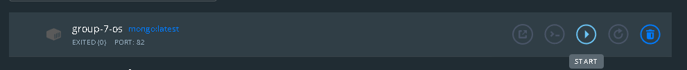

body {
background-color: lightblue;
}
h1 {
color: navy;
margin-left: 20px;
}

# <h1> projet-operating-system-Gp-7 

 
<pre>
Muhammad Muhaimin Bin Mazni (leader)  1917953 
Muhammad Nasrullah Bin Mat Radzi      2013677  
Aneesa Nadira Binti Aminuddin         2016174 
Rabiatul Adawiyah Binti Mohammad Azmi 2013214
</pre>
 
*Lecturer Dr. Rizal Bin Mohd. Nor*
 

## How to Install Dockers
Next, We will download the docker, go to the link below to do:
https://docs.docker.com/desktop/windows/install/ 

If you are using Mac you can choose the different version on the left side of the pages.
Give permission to the docker software and wait for the software to automatic install. 
After finishing click close to exit the software installations. 

How to start running docker:
Search docker on your desktops and click the docker, 
The docker will ask you to accept the term and you need to accept the term to continue.
## How to install WSL2[^2].
 1)The first step, After downloading the Wsl2 
 2)Right-click on the Installer and give the administrator admission to install the program to the apps. 
 3)Wait for the apps to install and pop up we click the “Next” button. 
 
 4)Then, the installing windows Subsytem for Linux update for windows will start and wait until installer to be doned.
 5)Click Finish when the installer is done and click finish when it is done.

## How to do Microservice in MongoDB[^3].
 1)After you open the docker, on the Homepage you will see MongoDB, click the “RUN: button to download the MongoDB images.
 2)When the running is done, you will see the live code of MongoDB, 
 3)Now your MongoDB is ready.

 introduction to docker
 Examples of code and commands
1) We can start the MongoDB container in docker by using the command in PowerShell 
2) In PowerShell, u can type 
“ docker run -d -p 82:82 --name group-7-os mongo:latest “
3) The “ -d “ (detach) flag means that the docker will run in the background 
The container port “82 “  the MongoDB default is bound back to port 82 on your host. 
4) You will connect to your MongoDB instance on “ localhost:82 “
  The port number can be changed by modifying the -p flag, let said we want localhost to 44334 we just need to rewrite the command line to 
“ docker run -d -p 44334:44334 --name group-7-os mongo:latest “
5) “ name group-7-os mongo: latest “
group-7-os will be the name of our container in Docker
mongo: latest will be the version of MongoDB we will use 
6) docker exec -it group-7-os mongo 
By using the command “ exec- it “ it will launch an interactive Mongo shell session in the terminal. It will allow faster interaction with your database without external dependencies.
7) docker logs group-7-os --follow
In this command we use the  –follow flag will make your log continually streamed on your terminal 
8) Connecting From Another Container
If you're using Docker to install Mongo, you'll probably want to connect to it from another container, such as your API server. Joining both to a shared Docker network is the best option. This eliminates the requirement for your host to publish Mongo ports, minimising your attack surface.

“ docker network create mongo-network
docker run -d --network mongo-network --name example-mongo mongo: latest “

The mongo network should also be joined by your "client" container. Within MongoDB connection strings, it will be permitted to refer to the container by name. It may, for example, contact the database by dialling example-mongo:27017.

9) If you want to host a real database in your Mongo container you must be using Docker Volumes..The data will not be lost when you stop the container or restart the Docker daemon, if you are using  Volume persist
10)The MongoDB image is configured to store all its data in the /data /db directory in the container filesystem. Mounting a volume to this location will ensure data is persisted outside the container.

 
 
example run mongodb on docker.
 first step is to click run of your group container in docker 
 
 next step is 
 
 

 

  

